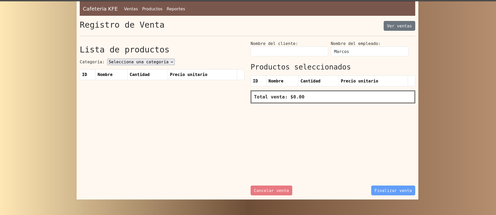
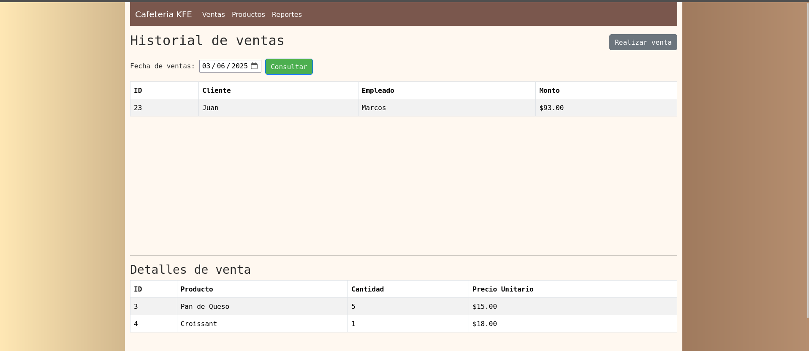
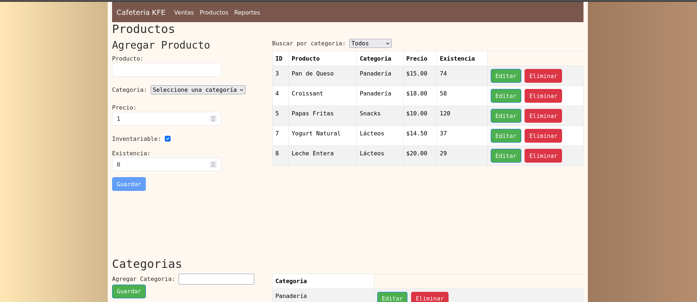
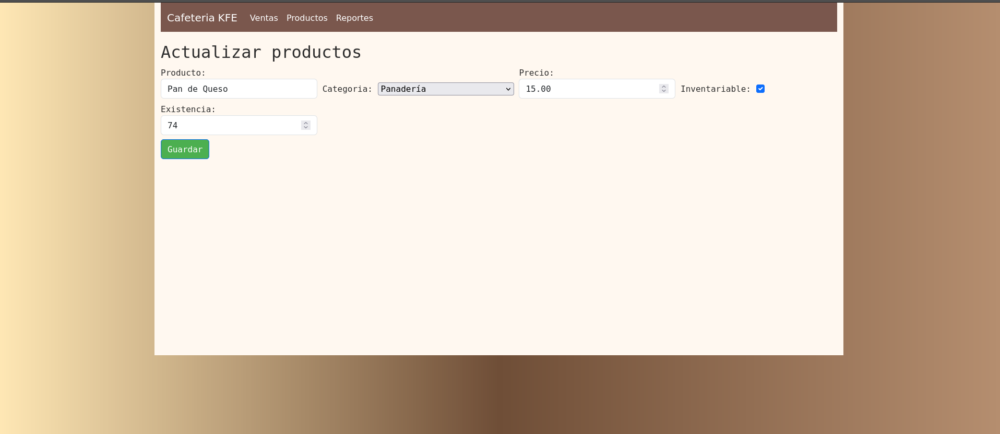
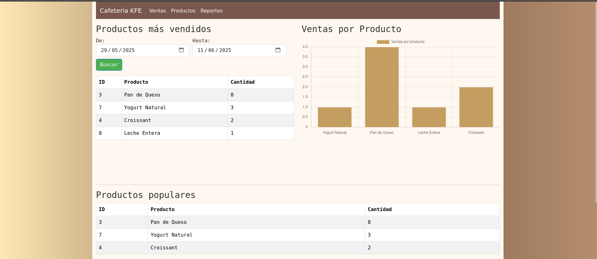

# 🌐 Proyecto - Sistema para Cafetería KFE

Aplicación web fullstack desarrollada como parte de una prueba técnica. El sistema permite gestionar operaciones de una cafetería, incluyendo punto de venta, administración de productos y reportes gerenciales.  
El proyecto está construido en **Flask (Python)**, con integración de **SQLAlchemy y MySQL** como base de datos, y renderizado de vistas mediante **Jinja2** y **Bootstrap**.

## ⚙️ Características  
- Punto de Venta
  - Historial de ventas realizadas.
- Administración
- Gerencial
  - Productos vendidos en un periodo de fechas.
  - 3 productos mas vendidos.
  - Gráfica de ventas por producto.
 

  

    <h3>Pantalla de Inicio - Ventas</h3>
    
    
  

    

    <h3>Administración</h3>
    
    
  

    

    <h3>Gerencias</h3>
    
  

## 🛠️ Tecnologías utilizadas
| Categoría          | Tecnologías            |
|---------------------|------------------------|
| Lenguajes           | Python, JavaScript     |
| Framework Backend   | Flask                  |
| Persistencia        | MySQL (SQLAlchemy ORM) |
| Frontend         | HTML, CSS, JavaScript, Jinja2, Bootstrap |
| Arquitectura        | MVC, AJAX              |
| Control de versiones| Git, GitHub            |
